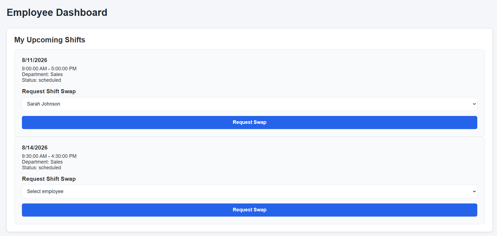

# Flexora - Employee Shift Scheduler

## Overview

Flexora is a full-stack employee shift scheduling and shift swap management application built with the MERN stack.

The goal of Flexora is to simplify employee scheduling for small businesses by allowing managers to create schedules, manage employee shifts, and approve shift swap requests without relying on paper schedules, spreadsheets, or group messages.

The application provides separate dashboards for managers and employees with role-based features and scheduling workflows.

---

# Features

## Authentication & Authorization

- JWT-based user authentication
- Protected routes
- Role-based access control
- Separate manager and employee permissions
- Secure password hashing with bcrypt

---

## Shift Management

Managers can:

- Create employee shifts
- Assign shifts to employees
- View team schedules
- View schedules through a calendar interface
- Monitor employee shift coverage

Employees can:

- View their upcoming shifts
- View assigned shift details
- See department information

Additional scheduling features:

- Prevents overlapping shifts for the same employee
- Validates shift start and end times
- Supports shift status tracking

---

## Shift Swap System

Employees can:

- Request a shift swap with another employee
- View swap request status

Managers can:

- View pending swap requests
- Approve swap requests
- Reject swap requests

Swap requests include:

- Requester
- Shift being swapped
- Requested employee
- Status tracking
- Created and updated timestamps

---

# Dashboards

## Manager Dashboard

The manager dashboard includes:

- Create Shift form
- Weekly schedule calendar
- Shift table
- Pending swap request management

Managers can manage employee schedules and handle swap approvals from one location.

---

## Employee Dashboard

The employee dashboard includes:

- Upcoming shifts
- Shift details
- Swap request form
- Personal schedule information

---

# Tech Stack

## Frontend

- React
- JavaScript
- Vite
- Axios
- React Big Calendar
- CSS

## Backend

- Node.js
- Express.js
- MongoDB
- Mongoose
- JWT
- bcrypt
- REST API architecture

---

# Installation

## Clone Repository

```bash
git clone https://github.com/JackyL1030/Capstone-Flexora

cd Flexora-Employee-Shift-Scheduler
```

---

# Backend Setup

Navigate to backend:

```bash
cd backend
```

Install dependencies:

```bash
npm install
```

Create a `.env` file:

```env
PORT=5000

MONGO_URI=your_mongodb_connection_string

JWT_SECRET=your_secret_key
```

Start backend server:

```bash
npm run dev
```

---

# Frontend Setup

Open another terminal:

```bash
cd frontend
```

Install dependencies:

```bash
npm install
```

Start frontend:

```bash
npm run dev
```

---

# API Endpoints

## Authentication

| Method | Endpoint          | Description |
| ------ | ----------------- | ----------- |
| POST   | `/api/auth/login` | Login user  |

---

## Users

| Method | Endpoint        | Description                |
| ------ | --------------- | -------------------------- |
| GET    | `/api/users/me` | Get current logged-in user |

---

## Shifts

| Method | Endpoint                 | Description     |
| ------ | ------------------------ | --------------- |
| GET    | `/api/shifts`            | Get shifts      |
| POST   | `/api/shifts`            | Create shift    |
| GET    | `/api/shifts/:id`        | Get shift by ID |
| PUT    | `/api/shifts/:id`        | Update shift    |
| PATCH  | `/api/shifts/:id/cancel` | Cancel shift    |

---

## Swap Requests

| Method | Endpoint                 | Description         |
| ------ | ------------------------ | ------------------- |
| POST   | `/api/swaps`             | Create swap request |
| GET    | `/api/swaps`             | Get swap requests   |
| PATCH  | `/api/swaps/:id/approve` | Approve swap        |
| PATCH  | `/api/swaps/:id/reject`  | Reject swap         |

---

# Screenshots

## Login


## Manager Dashboard


## Employee Dashboard



## Calendar View


## Swap Requests


---

# Future Improvements

Possible future improvements:

- Add loading states
- Notifications for changes
- Colors for approved/rejected status
- Employee availability management
- Drag-and-drop calendar scheduling
- Advanced scheduling analytics
- Mobile application support

---

# Author

Jacky Lai
